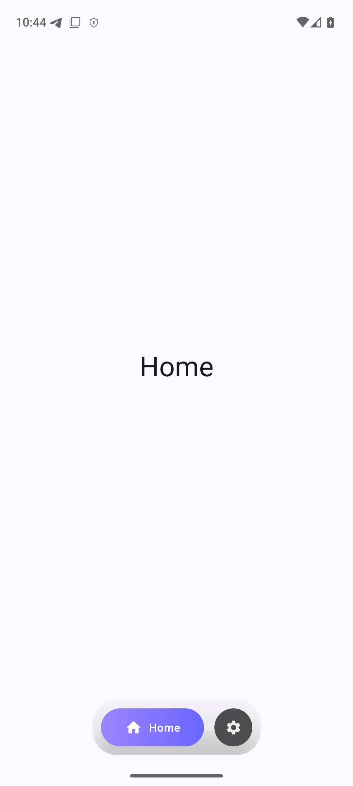
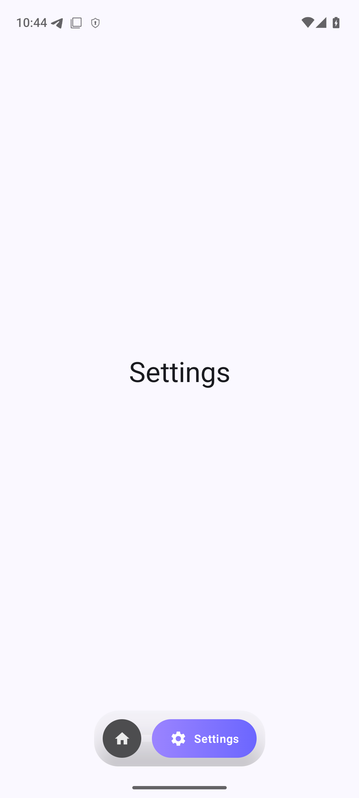

# Pvot Design System

A Jetpack Compose design system library for building consistent Android applications.

<p align="center">
  
  
</p>

## Project Structure

```
PvotLib/
├── app/              # Showcase app demonstrating components
├── design-system/    # Reusable library module
│   └── src/main/java/org/prauga/pvot/designsystem/
│       ├── components/navigation/
│       │   └── PvotNavBar.kt
│       └── theme/
│           ├── Color.kt
│           ├── Theme.kt
│           └── Type.kt
└── gradle/
    └── libs.versions.toml
```

## Installation

```kotlin
// settings.gradle.kts
include(":design-system")

// app/build.gradle.kts
dependencies {
    implementation(project(":design-system"))
}
```

Or (not now):
```kotlin
implementation("org.prauga.pvot:design-system:0.1.0")
```

## Quick Start

Wrap your app with `PvotAppTheme`:

```kotlin
class MainActivity : ComponentActivity() {
    override fun onCreate(savedInstanceState: Bundle?) {
        super.onCreate(savedInstanceState)
        setContent {
            PvotAppTheme {
                // Your app content
            }
        }
    }
}
```

## Theme

### PvotAppTheme

The main theme composable that provides Material 3 theming with extended color tokens.

```kotlin
@Composable
fun PvotAppTheme(
    darkTheme: Boolean = isSystemInDarkTheme(),
    dynamicColor: Boolean = true,
    navBarColors: PvotNavBarColors = PvotNavBarColors(...),
    content: @Composable () -> Unit
)
```

### Accessing Theme Colors

```kotlin
// Material 3 colors
MaterialTheme.colorScheme.primary

// Pvot extended colors
PvotTheme.navBarColors.gradient
PvotTheme.navBarColors.collapsedChipColor
PvotTheme.navBarColors.containerColor
PvotTheme.navBarColors.iconSelectedColor
PvotTheme.navBarColors.iconUnselectedColor
```

### Customizing Colors

Override navbar colors per-app:

```kotlin
PvotAppTheme(
    navBarColors = PvotNavBarColors(
        gradient = Brush.horizontalGradient(listOf(Color.Red, Color.Orange)),
        collapsedChipColor = Color.DarkGray,
        containerColor = Color.Black.copy(alpha = 0.3f),
        iconSelectedColor = Color.White,
        iconUnselectedColor = Color.LightGray
    )
) {
    // App content
}
```

## Components

### PvotNavBar

A floating bottom navigation bar with animated pill-style items.

```kotlin
@Composable
fun PvotNavBar(
    selectedTab: Int,
    onTabClick: (Int) -> Unit,
    tabs: List<TabItem>,
    modifier: Modifier = Modifier,
    barHeight: Dp = 64.dp,
    collapsedItemSize: Dp = 44.dp,
    expandedItemWidth: Dp = 120.dp,
    cornerRadius: Dp = 28.dp,
    gradient: Brush = PvotTheme.navBarColors.gradient,
    collapsedChipColor: Color = PvotTheme.navBarColors.collapsedChipColor,
    containerColor: Color = PvotTheme.navBarColors.containerColor
)
```

#### Usage

```kotlin
var selectedTab by remember { mutableIntStateOf(0) }

val tabs = listOf(
    TabItem(
        iconRes = R.drawable.ic_home,
        labelRes = R.string.tab_home,
        contentDescriptionRes = R.string.cd_home
    ),
    TabItem(
        iconRes = R.drawable.ic_settings,
        labelRes = R.string.tab_settings,
        contentDescriptionRes = R.string.cd_settings
    )
)

Scaffold(
    bottomBar = {
        PvotNavBar(
            selectedTab = selectedTab,
            onTabClick = { selectedTab = it },
            tabs = tabs
        )
    }
) { padding ->
    // Screen content
}
```

#### Features

- Animated pill expansion on selection
- Gradient background for selected item
- Smooth scale and fade animations
- Handles navigation bar padding automatically
- Fully customizable colors via theme or parameters

## Roadmap

### Components (Planned)

| Component | Description | Status |
|-----------|-------------|--------|
| PvotNavBar | Floating bottom navigation | Done |
| PvotTopBar | Collapsible top app bar | Planned |
| PvotCard | Styled card with elevation variants | Planned |
| PvotButton | Primary/Secondary/Tertiary buttons | Planned |
| PvotTextField | Styled text input fields | Planned |
| PvotDialog | Modal dialogs with consistent styling | Planned |
| PvotChip | Filter and action chips | Planned |
| PvotList | Styled list items with swipe actions | Planned |
| PvotFAB | Extended floating action button | Planned |
| PvotSheet | Bottom sheet with drag handle | Planned |

### Theme (Plans)

- Custom font integration
- Dark/Light mode previews
- Color palette generator
- Semantic color tokens (success, warning, error)
- Motion/animation tokens
- Spacing scale tokens

### Tooling (Plans)

- Compose Preview catalog
- Snapshot testing setup

## License

Apache License 2.0
