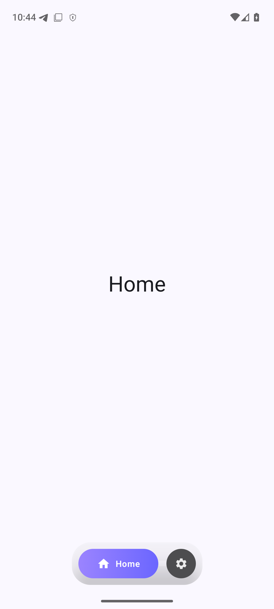
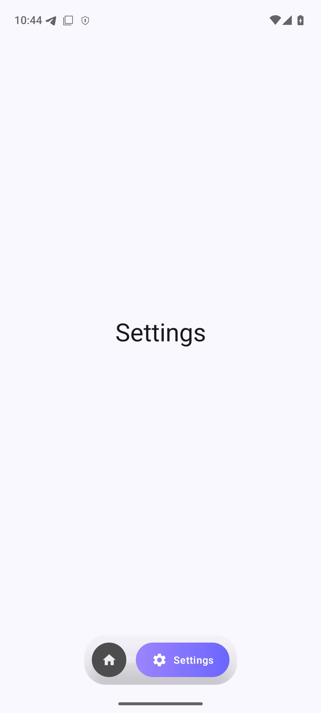

# Pvot Design System

A Jetpack Compose design system library for building consistent Android applications.

<p align="center">
  
  
</p>

## Project Structure

```
PvotLib/
├── app/              # Showcase app demonstrating components
├── design-system/    # Reusable design-system library module
│   └── src/main/java/com/prauga/pvot/designsystem/
│       ├── components/
│       │   ├── card/
│       │   │   └── PvotCard.kt
│       │   ├── navigation/
│       │   │   └── PvotNavBar.kt
│       │   ├── picker/
│       │   │   ├── PvotClockPicker.kt
│       │   │   ├── PvotDurationPicker.kt
│       │   │   ├── PvotPickerColors.kt
│       │   │   └── internal/
│       │   └── screen/
│       │       └── PvotScreen.kt
│       ├── theme/
│       │   ├── Color.kt
│       │   ├── Theme.kt
│       │   └── Type.kt
│       └── PvotBaseActivity.kt
├── core-ui/          # Shared UI utilities and state patterns
│   └── src/main/java/com/prauga/coreui/
│       ├── UiState.kt
│       ├── PvotLoadingContent.kt
│       ├── PvotErrorContent.kt
│       ├── PvotEmptyContent.kt
│       └── PvotSectionHeader.kt
└── gradle/
    └── libs.versions.toml
```

## Modules

| Module | Namespace | minSdk | Purpose |
|--------|-----------|--------|---------|
| `design-system` | `com.prauga.pvot.designsystem` | 27 | Reusable components and theming |
| `core-ui` | `com.prauga.coreui` | 27 | Shared UI utilities and state patterns |
| `app` | `com.prauga.pvot` | 29 | Showcase/demo app |

## Installation

```kotlin
// settings.gradle.kts
include(":design-system")
project(":design-system").projectDir = file("PvotLib/design-system")
include(":core-ui")
project(":core-ui").projectDir = file("PvotLib/core-ui")

// app/build.gradle.kts
dependencies {
    implementation(project(":design-system"))
    implementation(project(":core-ui"))
}
```

## Quick Start

Use `PvotBaseActivity` for edge-to-edge rendering and wrap your content with `PvotAppTheme`:

```kotlin
class MainActivity : PvotBaseActivity() {
    override fun onCreate(savedInstanceState: Bundle?) {
        super.onCreate(savedInstanceState)
        setPvotContent {
            PvotAppTheme {
                // Your app content
            }
        }
    }
}
```

## Theme

### PvotAppTheme

The main theme composable that provides Material 3 theming with extended color tokens.

```kotlin
@Composable
fun PvotAppTheme(
    darkTheme: Boolean = isSystemInDarkTheme(),
    dynamicColor: Boolean = true,
    navBarColors: PvotNavBarColors = PvotNavBarColors(...),
    pickerColors: PvotPickerColors = PvotPickerColors(...),
    content: @Composable () -> Unit
)
```

### Accessing Theme Colors

```kotlin
// Material 3 colors
MaterialTheme.colorScheme.primary

// Pvot extended colors
PvotTheme.navBarColors.gradient
PvotTheme.navBarColors.collapsedChipColor
PvotTheme.navBarColors.containerColor
PvotTheme.navBarColors.iconSelectedColor
PvotTheme.navBarColors.iconUnselectedColor

// Picker colors
PvotTheme.pickerColors.textColor
PvotTheme.pickerColors.textSecondaryColor
PvotTheme.pickerColors.selectionBackgroundColor

// NavBar sizes
PvotTheme.navBarSizes.barHeight
PvotTheme.navBarSizes.collapsedItemSize
PvotTheme.navBarSizes.expandedItemWidth
PvotTheme.navBarSizes.cornerRadius
```

### Customizing Colors

Override navbar colors per-app:

```kotlin
PvotAppTheme(
    navBarColors = PvotNavBarColors(
        gradient = Brush.horizontalGradient(listOf(Color.Red, Color.Orange)),
        collapsedChipColor = Color.DarkGray,
        containerColor = Color.Black.copy(alpha = 0.3f),
        iconSelectedColor = Color.White,
        iconUnselectedColor = Color.LightGray
    )
) {
    // App content
}
```

## Components

### PvotBaseActivity

Base activity that enables edge-to-edge rendering and provides a `setPvotContent()` helper for setting Compose content.

```kotlin
class MyActivity : PvotBaseActivity() {
    override fun onCreate(savedInstanceState: Bundle?) {
        super.onCreate(savedInstanceState)
        setPvotContent {
            PvotAppTheme {
                // Content
            }
        }
    }
}
```

### PvotNavBar

A floating bottom navigation bar with animated pill-style items.

```kotlin
@Composable
fun PvotNavBar(
    selectedTab: Int,
    onTabClick: (Int) -> Unit,
    tabs: List<PvotTabItem>,
    modifier: Modifier = Modifier,
    barHeight: Dp = 64.dp,
    collapsedItemSize: Dp = 44.dp,
    expandedItemWidth: Dp = 120.dp,
    cornerRadius: Dp = 28.dp,
    gradient: Brush = PvotTheme.navBarColors.gradient,
    collapsedChipColor: Color = PvotTheme.navBarColors.collapsedChipColor,
    containerColor: Color = PvotTheme.navBarColors.containerColor
)
```

#### Usage

```kotlin
var selectedTab by remember { mutableIntStateOf(0) }

val tabs = listOf(
    PvotTabItem(
        iconRes = R.drawable.ic_home,
        labelRes = R.string.tab_home,
        contentDescriptionRes = R.string.cd_home
    ),
    PvotTabItem(
        iconRes = R.drawable.ic_settings,
        labelRes = R.string.tab_settings,
        contentDescriptionRes = R.string.cd_settings
    )
)

Scaffold(
    bottomBar = {
        PvotNavBar(
            selectedTab = selectedTab,
            onTabClick = { selectedTab = it },
            tabs = tabs
        )
    }
) { padding ->
    // Screen content
}
```

#### Features

- Animated pill expansion on selection
- Gradient background for selected item
- Smooth scale and fade animations
- Handles navigation bar padding automatically
- Fully customizable colors and sizes via theme or parameters

### PvotScreen

A layout container for screens that wraps content in a `LazyColumn` with proper padding to account for the nav bar.

```kotlin
@Composable
fun PvotScreen(
    modifier: Modifier = Modifier,
    content: LazyListScope.() -> Unit
)
```

### PvotCard

A styled card wrapper with rounded corners and semi-transparent surface background.

```kotlin
@Composable
fun PvotCard(
    modifier: Modifier = Modifier,
    onClick: (() -> Unit)? = null,
    content: @Composable () -> Unit
)
```

### PvotClockPicker

A wheel-based time picker for selecting a time of day.

```kotlin
@Composable
fun PvotClockPicker(
    time: LocalTime,
    onTimeChange: (LocalTime) -> Unit,
    modifier: Modifier = Modifier
)
```

#### Usage

```kotlin
var selectedTime by remember { mutableStateOf(LocalTime.of(0, 0)) }

PvotClockPicker(
    time = selectedTime,
    onTimeChange = { selectedTime = it }
)
```

#### Features

- Clean domain-focused API using `java.time.LocalTime`
- Smooth wheel scrolling with snap behavior
- Adapts to light/dark theme automatically

### PvotDurationPicker

A wheel-based picker for selecting a time duration.

```kotlin
@Composable
fun PvotDurationPicker(
    duration: Duration,
    onDurationChange: (Duration) -> Unit,
    modifier: Modifier = Modifier
)
```

#### Usage

```kotlin
import kotlin.time.Duration.Companion.minutes

var selectedDuration by remember { mutableStateOf(30.minutes) }

PvotDurationPicker(
    duration = selectedDuration,
    onDurationChange = { selectedDuration = it }
)
```

#### Features

- Clean domain-focused API using `kotlin.time.Duration`
- Hours, minutes, and seconds wheels
- Smooth wheel scrolling with snap behavior
- Adapts to light/dark theme automatically

## Core UI

The `core-ui` module provides shared UI utilities and state management patterns.

### UiState

A sealed class for managing common screen states:

```kotlin
sealed class UiState<out T> {
    data object Loading : UiState<Nothing>()
    data class Success<T>(val data: T) : UiState<T>()
    data class Error(val message: String) : UiState<Nothing>()
}
```

### Utility Composables

| Composable | Description |
|------------|-------------|
| `PvotLoadingContent` | Centered `CircularProgressIndicator` |
| `PvotErrorContent` | Displays an error message |
| `PvotEmptyContent` | Displays an empty state message |
| `PvotSectionHeader` | Section title in `titleMedium` style |

## Build Configuration

| Setting | Value |
|---------|-------|
| compileSdk | 36 |
| minSdk | 27 (library), 29 (app) |
| targetSdk | 36 |
| JVM target | 11 |
| Kotlin | 2.0.21 |
| AGP | 8.13.2 |
| Compose BOM | 2025.12.01 |

## Roadmap

### Components (Planned)

| Component | Description | Status |
|-----------|-------------|--------|
| PvotNavBar | Floating bottom navigation | Done |
| PvotClockPicker | Wheel-based time picker | Done |
| PvotDurationPicker | Wheel-based duration picker | Done |
| PvotCard | Styled card with surface variant | Done |
| PvotScreen | Screen layout with nav bar padding | Done |
| PvotBaseActivity | Edge-to-edge base activity | Done |
| UiState | Loading/Success/Error state pattern | Done |
| PvotTopBar | Collapsible top app bar | Planned |
| PvotButton | Primary/Secondary/Tertiary buttons | Planned |
| PvotTextField | Styled text input fields | Planned |
| PvotDialog | Modal dialogs with consistent styling | Planned |
| PvotChip | Filter and action chips | Planned |
| PvotList | Styled list items with swipe actions | Planned |
| PvotFAB | Extended floating action button | Planned |
| PvotSheet | Bottom sheet with drag handle | Planned |

### Theme (Plans)

- Custom font integration
- Dark/Light mode previews
- Color palette generator
- Semantic color tokens (success, warning, error)
- Motion/animation tokens
- Spacing scale tokens

### Tooling (Plans)

- Compose Preview catalog
- Snapshot testing setup

## License

Apache License 2.0
